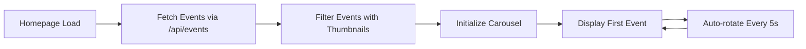

# Design Document

## Overview

This design enhances the PicMe homepage by replacing the static hero image with a dynamic carousel displaying real event images from the database, and removes the testimonials section to streamline the user experience. The solution leverages existing API endpoints and maintains the current visual design language.

## Architecture

### Component Structure

```
Homepage (homepage.html)
├── Hero Section (Modified)
│   ├── Text Content (Unchanged)
│   └── Dynamic Image Carousel (New)
│       ├── Event Image Display
│       ├── Event Metadata Overlay
│       └── Auto-rotation Logic
├── How It Works Section (Unchanged)
├── Featured Events Section (Unchanged)
├── Testimonials Section (Removed)
└── CTA Section (Unchanged)
```

### Data Flow



## Components and Interfaces

### 1. Hero Image Carousel Component

**Location**: `frontend/pages/homepage.html` - Hero Section

**Functionality**:
- Fetches event data from existing `/api/events` endpoint
- Filters events that have `cover_thumbnail` or valid images
- Displays event images in a rotating carousel
- Shows event metadata overlay (name, category, photo count)
- Auto-rotates through events every 5 seconds
- Provides manual navigation controls (optional)

**HTML Structure**:
```html
<div class="relative rounded-xl overflow-hidden shadow-2xl">
    
    <div class="absolute inset-0 bg-gradient-to-t from-black/60 to-transparent"></div>
    <div class="absolute bottom-0 left-0 p-6 text-white">
        <p id="heroEventCategory" class="text-sm font-medium"></p>
        <h3 id="heroEventName" class="text-xl font-bold"></h3>
        <p id="heroEventPhotos" class="text-sm"></p>
    </div>
    <!-- Optional: Navigation dots -->
    <div id="carouselDots" class="absolute bottom-4 right-4 flex space-x-2"></div>
</div>
```

**JavaScript Logic**:
```javascript
let heroEvents = [];
let currentHeroIndex = 0;
let heroInterval = null;

async function loadHeroEvents() {
    // Fetch events from API
    // Filter events with valid images
    // Initialize carousel
    // Start auto-rotation
}

function updateHeroImage(index) {
    // Update image src
    // Update metadata overlay
    // Add fade transition
    // Update navigation dots
}

function startHeroRotation() {
    // Auto-rotate every 5 seconds
}
```

### 2. API Integration

**Endpoint**: `GET /api/events`

**Response Structure** (existing):
```json
[
  {
    "id": "event_931cd6b8",
    "name": "Tech Conference 2025",
    "location": "RNSIT campus, Bengaluru",
    "date": "2025-09-12",
    "category": "Conference",
    "cover_thumbnail": "/uploads/thumbnails/event_931cd6b8_thumb_abc123.jpg",
    "photos_count": 245,
    "organization_name": "Tech Events Inc",
    "created_at": "2025-01-10T10:30:00"
  }
]
```

**Filtering Logic**:
- Prioritize events with `cover_thumbnail` field
- Fall back to events with valid `image` field
- Exclude events without any images
- Sort by `created_at` (most recent first)
- Limit to top 5-10 events for carousel

### 3. Testimonials Section Removal

**Action**: Remove entire testimonials section from HTML

**Section to Remove**:
- Lines containing `<!-- Testimonials Section -->` through the closing `</section>` tag
- Approximately 80-100 lines of HTML
- Includes all three testimonial cards and container

**Impact**:
- Reduces page length
- Improves load time
- Maintains visual flow from "How PicMe Works" to "CTA Section"

## Data Models

### Event Data (Existing)

```typescript
interface Event {
  id: string;
  name: string;
  location: string;
  date: string;
  category: string;
  cover_thumbnail?: string;  // Primary image source
  image?: string;            // Fallback image source
  photos_count: number;
  organization_name: string;
  created_at: string;
}
```

### Hero Carousel State

```typescript
interface HeroCarouselState {
  events: Event[];           // Filtered events with images
  currentIndex: number;      // Current displayed event
  intervalId: number | null; // Auto-rotation timer
  isTransitioning: boolean;  // Prevent rapid clicks
}
```

## Error Handling

### Scenario 1: No Events Available
- **Condition**: API returns empty array or no events with images
- **Handling**: Display default placeholder image with generic text
- **Fallback Image**: Use existing Unsplash concert image or create default event image

### Scenario 2: API Request Fails
- **Condition**: Network error or server error
- **Handling**: Display default placeholder image
- **User Message**: No error message shown (graceful degradation)
- **Retry**: No automatic retry (user can refresh page)

### Scenario 3: Image Load Failure
- **Condition**: Event image URL is broken or inaccessible
- **Handling**: Skip to next event in carousel
- **Fallback**: Use default event thumbnail if all images fail

### Scenario 4: Single Event Available
- **Condition**: Only one event with valid image
- **Handling**: Display single event without rotation
- **UI**: Hide navigation dots, disable auto-rotation

## Testing Strategy

### Manual Testing

1. **Hero Carousel Functionality**
   - Verify carousel loads with real event images
   - Confirm auto-rotation works (5-second intervals)
   - Test image transitions are smooth
   - Verify metadata displays correctly
   - Test with 0, 1, 3, and 10+ events

2. **Testimonials Removal**
   - Confirm testimonials section is completely removed
   - Verify page layout remains intact
   - Check spacing between remaining sections
   - Test responsive design on mobile/tablet

3. **Error Scenarios**
   - Test with no events in database
   - Test with events but no images
   - Test with network disconnected
   - Test with invalid image URLs

4. **Cross-browser Testing**
   - Chrome, Firefox, Safari, Edge
   - Mobile browsers (iOS Safari, Chrome Mobile)

### Performance Testing

1. **Page Load Time**
   - Measure initial page load with carousel
   - Compare before/after testimonials removal
   - Verify image lazy loading (if implemented)

2. **API Response Time**
   - Monitor `/api/events` endpoint performance
   - Verify caching is working (5-minute cache)

## Implementation Notes

### Existing Code to Leverage

1. **Featured Events Section**: Already has similar logic for fetching and displaying events
   - Reuse the `loadFeaturedEvents()` function pattern
   - Use same API endpoint and error handling

2. **Existing Styles**: Maintain current Tailwind CSS classes
   - Keep shadow, rounded corners, gradient overlay
   - Preserve responsive design patterns

3. **Caching**: API already has 5-minute cache
   - No backend changes needed
   - Carousel will use cached data

### Performance Considerations

1. **Image Optimization**
   - Use `cover_thumbnail` field (already optimized)
   - Add `loading="lazy"` for off-screen images
   - Consider preloading next image in carousel

2. **Transition Effects**
   - Use CSS transitions for smooth fades
   - Avoid JavaScript animations for better performance

3. **Memory Management**
   - Clear interval on page unload
   - Limit carousel to 10 events maximum

### Accessibility

1. **ARIA Labels**
   - Add `aria-label` to carousel container
   - Add `aria-live="polite"` for screen readers
   - Provide alt text for all images

2. **Keyboard Navigation** (Optional Enhancement)
   - Arrow keys to navigate carousel
   - Pause on focus

3. **Reduced Motion**
   - Respect `prefers-reduced-motion` media query
   - Disable auto-rotation if user prefers reduced motion

## Design Decisions and Rationales

### Decision 1: Use Existing API Endpoint
**Rationale**: The `/api/events` endpoint already provides all necessary data including thumbnails and metadata. No backend changes required, reducing implementation complexity and risk.

### Decision 2: Auto-rotation Every 5 Seconds
**Rationale**: Standard carousel timing that gives users enough time to read event information without feeling rushed. Matches common UX patterns.

### Decision 3: Remove Testimonials Entirely
**Rationale**: Per user request, removes visual clutter and reduces page length. Social proof can be provided through other means (event counts, user counts, etc.).

### Decision 4: Graceful Degradation for No Events
**Rationale**: New installations or test environments may have no events. Showing a default image prevents broken UI and maintains visual appeal.

### Decision 5: Limit Carousel to Recent Events
**Rationale**: Showing too many events in rotation can be overwhelming. Limiting to 5-10 most recent events keeps content fresh and relevant.

### Decision 6: No Manual Navigation Controls (Initial Version)
**Rationale**: Simplifies implementation. Auto-rotation provides sufficient functionality. Can be added as enhancement if needed.

## Future Enhancements (Out of Scope)

1. Manual navigation controls (prev/next buttons)
2. Pause on hover functionality
3. Click to navigate to event detail page
4. Parallax scrolling effects
5. Video support in carousel
6. Admin control over featured events
